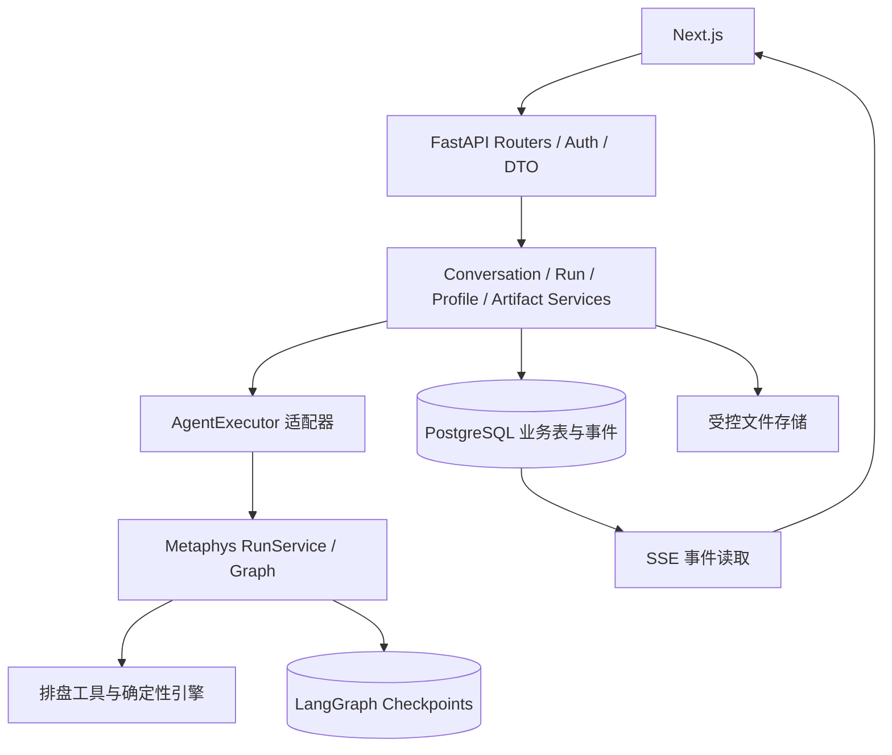

# Metaphys 后端应用层设计方案 v1

日期：2026-09-12 · 状态：设计提案，未实施

## 1. 结论与范围

建议采用 **FastAPI 模块化单体 + 应用服务 + PostgreSQL 持久化 + 独立运行生命周期 + 可重放 SSE**。保留现有 Next.js 前端及 metaphys harness，将现在集中于 `gateway/main.py` 的身份、会话、运行、事件和文件管理拆开。

deer-flow 值得借鉴的是应用装配、运行管理、所有权校验、持久化和流订阅分离。Metaphys 应围绕“出生资料 → 确定性排盘 → 有依据的解读 → 可追溯结果”组织业务，不需要复制通用 Agent 平台。

第一阶段保持一个后端进程，不引入 Redis、Celery、微服务、插件市场、沙箱、IM 渠道或完整 LangGraph Platform 兼容 API。PostgreSQL 同时承载应用数据与 checkpoint，但两者拥有独立表和生命周期接口。

本方案根据两份本地源码设计；参考项目文档仅作为架构背景，不视为要求我们执行其中的开发或部署流程。没有修改业务代码，也没有执行数据库迁移。

## 2. 当前问题与参考依据

下表路径分别相对 metaphys 和 deer-flow 根目录。依据为本次读取的工作区源码，不承诺与上游最新版本相同。

| 主题 | Metaphys 当前实现 | deer-flow 参考实现 | 适配决策 |
|---|---|---|---|
| 应用装配 | `backend/app/gateway/main.py` 的 create_app 内同时定义依赖、路由、执行任务和清理 | `backend/app/gateway/app.py`、`deps.py` 分离 lifespan 与依赖提供 | 引入 bootstrap/container，路由只处理 HTTP |
| 业务存储 | `gateway/store.py` 内存字典；存储层直接抛 HTTPException | `persistence/run/model.py`、`sql.py` 提供运行记录与原子准入 | 应用仓储不依赖 FastAPI；用事务约束替代 busy 布尔值 |
| 运行对象 | `busy/failed`、Task 集合、harness 临时 run_id；失败后整个会话禁止继续 | `runtime/runs/schemas.py`、`gateway/services.py:start_run` | Run 独立实体；失败属于一轮运行，恢复策略另行判断 |
| 断线恢复 | Queue 仅服务当前连接；任务继续但无法按事件位置重放 | `runtime/stream_bridge/base.py` 有事件 ID、重连游标和 StreamGap | 持久化公开事件；HTTP 订阅与后台执行解耦 |
| 并发与重试 | 进程内 busy 与任务数量限制 | `persistence/run/model.py` 活跃线程唯一索引、幂等索引；`sql.py` 租约和原子接管 | 首期数据库准入与幂等；多 worker 租约延后 |
| 身份 | Cookie 对应 Session，Session 直接拥有 Conversation | `gateway/authz.py` 的 principal/permission/owner；`routers/thread_runs.py` 按 owner+thread 限定幂等键 | 身份和浏览器会话分离；所有业务资源强制 owner 范围 |
| 命盘文件 | 从当前 astro 结果推导 SVG 文件路径，无资源记录或完整删除流程 | `gateway/routers/artifacts.py` 所属线程资源端点；gateway 指南定义下载边界 | 建立 Artifact 元数据；保留本项目受控 SVG 展示，不能原样照搬下载策略 |
| 可用性 | 无持久化探针和恢复流程 | `gateway/health.py` 分开 liveness/readiness，并检查应用数据库与 checkpoint | 检查真实启动依赖；恢复完成后才 ready |

参考项目本身的 `services.py` 仍依赖 Request/HTTPException，而且承载很多平台兼容逻辑。因此借鉴职责划分，不直接拷贝服务文件。

## 3. 分层和目录



建议目录：

```text
backend/app/
  bootstrap.py                 # 资源构造、启动校验、关闭顺序
  gateway/
    main.py                    # create_app 与路由注册
    dependencies.py            # Principal、应用服务注入
    errors.py                  # 领域错误 → HTTP 错误
    middleware/                # CSRF、Origin、请求限制、trace
    routers/                   # sessions/conversations/runs/profiles/artifacts/health
    schemas/                   # 请求与公开响应 DTO
  application/
    conversations.py           # 创建、查询、归档、删除
    runs.py                    # 准入、状态转换、取消、结果提交
    profiles.py                # 出生资料版本与确认
    artifacts.py               # 注册、授权读取、清理
    recovery.py                # 重启恢复与删除补偿
    ports.py                   # Repository、UnitOfWork、AgentExecutor、ArtifactStorage
  domain/
    models.py                  # 业务实体与值对象
    errors.py                  # 无 HTTP 依赖的错误
    policies.py                # 所有权、状态转换、资料使用约束
  infrastructure/
    database/                  # SQLAlchemy 仓储、事务、迁移
    execution/                 # 调用 metaphys harness 的适配器
    events/                    # SQL 事件读写、订阅唤醒
    storage/                   # 本地文件适配器
    identity/                  # session 持久化与身份提供器
backend/packages/harness/metaphys/  # 保留既有 Agent / tools / engines
```

依赖规则：gateway → application → domain/ports；infrastructure 实现 ports；bootstrap 负责组合。harness 不导入 app、FastAPI 或应用 ORM。应用层不计算命盘，也不重新实现 Safety/Grounding 判定。

`AgentExecutor` 提供 `execute(run_context, input)`、`get_settled_result(execution_id)`、`delete_execution(execution_id)` 等明确接口；不再由路由读取 `runner._graph` 或直接操作 checkpointer。图构造时注入持久化 checkpointer，不依赖外部修改图内部字段。

## 4. 数据模型和事实来源

| 实体/表 | 关键字段 | 约束与职责 |
|---|---|---|
| principals | id、kind(local/user)、created_at | 稳定的数据所有者；账户体系通过此身份接入 |
| sessions | token_hash、principal_id、expires_at、revoked_at | 不存原始会话 token；Cookie 轮换不会改变数据归属 |
| conversations | id、owner_id、title、status、latest_run_id、active_execution_id、version | 不向客户端接受 owner_id / 内部 execution ID；软删除后停止准入 |
| messages | id、conversation_id、run_id、seq、role、content、response_status | 用户可见历史的事实来源；不保存隐藏推理为公开消息 |
| runs | id、conversation_id、status、input、input_hash、idempotency_key_hash、execution_id、base_execution_id、result、error_code、timestamps | 一轮独立记录；结果固定在该 run，不从会话最新 checkpoint 冒充历史结果 |
| run_events | run_id、seq、type、schema_version、payload、created_at | 唯一(run_id,seq)；仅存允许公开的事件 |
| birth_profiles / profile_versions | owner_id、profile_id、revision、原始钟表时间、地点、经纬度、精度、确认信息 | 版本不可变；修改生成新版本，不能覆盖历史排盘依据 |
| charts | id、owner_id、profile_version_id、kind、engine_version、config_hash、schema_version、payload | 确定性引擎产物；当前可用性由资料版本和配置决定 |
| run_charts | run_id、chart_id | 明确一轮实际采用的命盘；不等同于会话最后展示的命盘 |
| artifacts / artifact_refs | id、storage_key、mime、digest、size、status；资源与 chart/run 引用 | 下载由记录授权；资源路径不由用户拼接 |
| audit_events | run_id、message_id、category、policy_version、action、created_at | 当前输出审计与历史记录分离；默认不记录被拦截原文 |
| cleanup_jobs | id、resource_id、phase、attempts、next_attempt_at | 跨数据库/checkpoint/文件的删除补偿，重复执行安全 |

应用表负责业务历史；checkpoint 负责图执行上下文；文件负责二进制产物。不要把三者互相当作替代品。公开消息和结果在一次完成事务内写入，避免再次出现两套可变历史各自追加。

核心数据库约束：

- 同一 conversation 至多一个 `queued/running/cancel_requested` Run，使用部分唯一索引；删除与运行准入都先锁 conversation 行。
- 幂等键唯一范围为 owner + conversation + 客户端键；同键不同 input_hash 返回 409。
- messages 的 conversation+seq、run_events 的 run+seq 唯一；assistant 结果每 run 至多一份。
- 子资源引用必须验证所属 owner；查询仓储要求显式 Principal，缺失身份拒绝访问。
- 应用时间戳存 UTC；出生钟表时间保持现有本地时间语义，两者不能混淆。

首期采用 PostgreSQL 一种持久化实现，内存仓储仅用于测试。暂不同时维护 SQLite/PostgreSQL 两套生产后端。账户登录可后续接入，但 stable principal 与持久化 session 要一起落地；仅本机模式允许本地身份，不能靠客户端提交的 Host 自行获得该身份。

## 5. 运行生命周期

```text
queued → running → succeeded
                → failed
                → timed_out
                → cancel_requested → cancelled
queued → cancelled
```

`response_status` 与运行状态分开：成功运行可以返回 completed、withheld、safety_redirect 或 needs_input。追问属于本轮成功结束，不是持续占用 worker 的“等待用户”任务；后续回答创建新 Run。

### 5.1 创建和执行

1. 验证 session、CSRF、owner、输入长度、资料版本；只接受受限业务输入，不接受任意 graph config、系统消息或工具白名单。
2. 在短事务内锁定 conversation，先检查幂等重用，再检查删除状态和活跃 Run；写 queued Run、唯一用户消息与 run.accepted 事件。
3. 提交后由进程内 supervisor 唤醒执行器；它也定期扫描 queued，解决“数据库提交成功但 create_task 前崩溃”的空窗。数据库队列有上限和排队超时。
4. worker 原子领取 queued → running；一次只调用统一 AgentExecutor。run_id 由应用生成并贯穿 harness、日志、审计与事件，不能两层各生成一个。
5. 只持久化安全的进度摘要。最终 graph 结果通过现有 Safety/Grounding 后，应用校验 DTO、登记命盘及文件引用。
6. 单一业务事务提交 assistant message、run.result、run_charts、audit_events、conversation 最新结果指针、final 与 end 事件，并置 succeeded；提交后才通知订阅者。

数据库事务不得跨越模型调用。排盘和文件工作发生在事务外，事务内只做短时数据写入。

### 5.2 checkpoint 与业务事务之间的空窗

PostgreSQL 同库并不意味着 LangGraph checkpoint 和应用事务天然原子。首期建议使用**每 Run 独立的内部 execution_id**：从上一成功 Run 的已完成状态初始化新执行；成功提交时才推进 conversation.active_execution_id。

这样失败或取消产生的部分 checkpoint 不会成为下一轮上下文。独立执行使用新 checkpoint namespace/thread 标识，由适配器完成状态读取与初始化，禁止直接复制底层 checkpoint 表。需用当前 LangGraph 版本验证状态初始化与消息 ID 语义；此项是实施前的技术验证门槛。

若验证不通过，第一版保留现有“失败后需新建会话”限制并清晰暴露 `recovery_required`，不可直接在污染状态上宣称支持恢复。后续采用可验证的已完成 checkpoint 恢复策略替代。

崩溃恢复规则：queued 可以重新领取；running 若存在带同一 run_id 的可信完成标记，可幂等提交业务结果；无法证明完成时标记 failed/server_restart。**不自动重跑不确定的模型请求**，避免重复消耗与重复副作用。用户重试生成新 run_id，并记录 retry_of。

### 5.3 取消和并发

取消先持久化请求，再通知本地 worker；queued 可直接 cancelled，running 在取消与完成竞争时由状态条件更新确定胜方。取消成功后不得再发布成功 final 或推进已完成上下文。

默认同会话新请求遇活跃 Run 返回 409；跨会话按全局并发上限执行，队列容量满返回 429。取消不代表供应商已经停止计费；记录已知 usage，缺失使用 null 而非 0。

首期部署只允许单 worker，并由启动配置拒绝多 worker。未来扩容才增加 owner_worker_id、lease_expires_at、递增 fencing token、条件续租和孤儿接管；旧 worker 的 checkpoint 写入也必须隔离，不能只防住业务表写入。

## 6. 可恢复 SSE 与 API

建议新增 `/api/v1`；旧端点以兼容适配器调用同一应用服务，不能保留另一套执行逻辑。

| 接口 | 行为 |
|---|---|
| GET /api/v1/session | 当前身份、CSRF、能力信息；不夹带全部会话历史 |
| POST /api/v1/conversations | 创建会话 |
| GET /api/v1/conversations?cursor=&limit= | 按 updated_at+id 稳定游标分页 |
| GET /api/v1/conversations/{id} | 元信息、当前结果摘要、active_run |
| GET /api/v1/conversations/{id}/messages | 分页公开历史 |
| POST /api/v1/conversations/{id}/runs | 创建；Idempotency-Key 必填，返回 202 与 run_id/events_url |
| GET /api/v1/conversations/{id}/runs/{run_id} | 固定于该 Run 的状态与结果 |
| GET /api/v1/conversations/{id}/runs/{run_id}/events | SSE；Last-Event-ID 重放 |
| POST /api/v1/conversations/{id}/runs/{run_id}/cancel | 持久化取消意图，重复请求安全 |
| DELETE /api/v1/conversations/{id} | 无活跃 Run 时进入 deleting，202 返回删除任务 |
| POST /api/v1/profiles | 建立出生资料 |
| POST /api/v1/profiles/{id}/versions | 建立不可变资料版本 |
| POST /api/v1/profiles/{id}/versions/{version}/confirm | 用户确认精确时间，服务端记录确认来源 |
| GET /api/v1/charts/{id} | 所属用户的结构化命盘 |
| GET /api/v1/artifacts/{id}/content | 验证 owner 与有效引用后读取 |
| GET /api/v1/deletions/{id} | 删除阶段与完成状态 |
| GET /health/live、/health/ready | 存活与就绪分离 |

统一错误：`{error:{code,message,retryable,request_id}}`。401 未登录；404 未拥有或不存在的资源；409 忙/幂等冲突/版本冲突；422 输入错误；429 容量限制；503 依赖未就绪。不要把供应商异常、原始输入或服务端路径发给客户端。

SSE 建议公开事件：`run.accepted`、`run.started`、`run.progress`、`run.final`、`run.failed`、`run.cancelled`、`run.end`、`stream.gap`。timeout 使用 run.failed + error_code=run_timeout。

```json
{"schema_version":1,"run_id":"…","seq":12,"type":"run.final","data":{"response_status":"completed","reply":"…","chart_ids":["…"]}}
```

SSE `id` 编码 run_id 与 seq，校验游标所属；非法游标返回 400。事件先入库再通知，数据库是重放依据，进程内通知只是低延迟优化；断线不取消运行。顺序读取持久化事件并周期轮询可以避免“重放结束→订阅开始”的漏事件窗口，首期无需 Redis。

客户端按 run_id+seq 去重；心跳不占业务序号；终态仍允许读取保留的 final/end。游标已过保留窗口时发 stream.gap，前端 GET Run 获取固定结果，不把不完整重放视为完整历史。建议进度事件保留 7 天，Run 结果随会话保留；此为产品默认提案，可配置。

Next.js 改动集中于 `lib/api.ts`、`lib/sse.ts`、`lib/types.ts` 与 Workspace：先创建 Run 再订阅、保存最后序号、重连复用同一 run_id、按钮发送取消请求。保留当前静态导出和同源策略，不要求新增 Next 服务端业务层。暂不换用 deer-flow 的 LangGraph SDK hook，以免为 UI 引入完整兼容协议。

## 7. Metaphys 专属业务约束

### 出生资料与确认

出生资料拥有独立版本。地点修正、精确时间变化、坐标变化和时间精度升级都生成新版本；历史命盘继续绑定旧版本。

确认记录至少包含 profile_version_id、normalized_time、source(user_form/user_message)、confirmed_at。请求必须来自已认证用户且经 CSRF 检查；模型生成的 `confirmed=true` 不能成为证据。当前“确认出生时间：…”语法在迁移期保留，适配层把用户原始输入解析成同等确认凭证，并在工具边界校验绑定的资料版本。

不趁此次应用层重构扩大时区能力：现有中国本地钟表时间语义继续有效，国际时区/DST 属于独立引擎与 schema 升级。

### 命盘和解读溯源

每张命盘固定记录资料版本、引擎版本、派别/宫制等配置与 schema 版本。只有同资料版本且配置匹配的命盘才能作为当前有效依据；不能从 conversation 当前 charts 推断某个历史 Run 使用了哪张盘。

应用层登记工具实际采用/生成的资料和命盘，不从 AI 正文反向解析排盘数据。harness 需输出结构化 provenance 或工具 receipt；顶层 birth_profile 只是最终状态摘要，不足以表达一轮涉及多个资料的关系。首期一轮只允许一个主体，遇换人需求先明确选择资料版本。

### 安全和核验

保留现有“最终核验后公开正文”边界，不为了流式体验提前输出模型 token。Safety/Grounding 的历史审计存 audit_events，当前回复状态取该消息对应的判定；规则版本记入 Run，使之后可解释为何替换某次回复。

现有 M5 是有限句式规则，应用层完善不能被描述为语义风险识别已经完成。真实模型联调与对抗样本验收仍是独立待办。

### SVG 与删除

保留受控 SVG 预览、路径边界、MIME 和 CSP 防护。应用以 opaque artifact_id 定位，工具生成文件先暂存，验证后原子移入受控存储并登记。

首期避免跨用户去重；同用户内共享文件也必须使用引用记录。删除会话先锁定并置 deleting，拒绝新运行；清理任务删除 execution/checkpoint、会话专属消息/结果/审计、资源引用，再删除无引用文件，最后完成删除记录。账户级出生档案并不因删除某次会话自动删除，UI 应明确此范围；资料删除需单独处理所有引用。

数据库与文件不能用一次事务删除，cleanup_jobs 必须支持重试。标记 deleting 后读取立即拒绝；任务完成前不能声称已彻底删除。临时未登记文件定期按宽限期回收。备份中的删除随备份保留窗口生效，实施时需配置并向用户说明。

## 8. 启停、配置与观测

启动：校验配置 → 建数据库连接池 → 校验迁移版本 → 建 checkpointer → 装配 graph/executor → 恢复未完成 Run 和删除任务 → 启动 supervisor → ready。迁移由独立命令执行，应用发现 schema 不匹配则拒绝就绪。

关闭：停止准入 → 在总截止时间内等待运行 → 对剩余运行持久化中断状态并取消 → 关闭订阅与后台任务 → 关闭 checkpointer/数据库。不要逐个任务无限等待。

配置分为 database、execution、events、identity、artifacts、retention。持久化后端、身份模式与 worker 数必须重启生效；Run 固化 model、prompt、policy、engine 的版本/配置摘要，密钥不进入快照。

保留 HttpOnly/SameSite Cookie、CSRF、Origin、路径隔离和 CSP；实际累计读取请求体字节数也要限额，不能仅依赖 Content-Length。公网账户方案另阶段接入经过验证的身份提供器，默认不开放匿名共享 principal。

观测只记录 request_id、run_id、阶段、耗时、错误码和脱敏身份标识，默认不记录出生时间、坐标、姓名和完整提示词。指标包括排队时间、运行耗时、失败/超时/取消、重放缺口、数据库错误、核验替换数量。readiness 检查应用数据库和实际使用的 checkpoint 后端；不每次调用收费模型接口。

## 9. 实施顺序与验收

| 阶段 | 交付 | 完成标准 |
|---|---|---|
| A：职责拆分 | router/service/ports/container；统一错误；Run ID 贯通 | 原有 API、Cookie/CSRF、SVG、Next.js 功能保持；harness 边界检查通过 |
| B：可持久化闭环 | PostgreSQL、迁移、principal/session、会话/Run/message/event；checkpointer 注入与执行隔离验证 | 重启后恢复历史；跨 owner 全资源拒绝；失败 checkpoint 不进入正常后续轮次 |
| C：运行与流恢复 | 数据库准入、幂等、队列、取消、事件重放、崩溃补偿；Next.js v1 适配 | 同键只执行一次；同会话并发只有一轮准入；断网重连不重跑、不漏终态；重启不永久 busy |
| D：业务资料与资源 | profile 版本、确认凭证、chart provenance、审计、artifact 引用与删除任务 | 更换出生资料不串盘；伪造确认无效；历史 Run 结果固定；共享资源不误删 |
| E：上线准备 | 账户身份集成、部署、备份恢复、观测、真实模型验收 | 实际恢复演练、账号隔离、真实模型链路通过；无凭据时明确标注未验收 |

B/C 先形成“创建会话→运行→结果入库→断线重连→重启恢复”的纵向闭环，再展开资料管理 UI。避免先做一批只有 CRUD、尚未接入执行流程的模块。

关键故障测试：准入提交后未调度即崩溃；checkpoint 完成后结果事务前崩溃；结果提交后 SSE 通知前崩溃；完成与取消竞争；删除与准入竞争；慢订阅超出事件窗口；同键不同输入；越权访问 Run/SVG/删除任务；文件创建但登记失败。数据库约束必须在真实 PostgreSQL 集成测试中验证，不能仅靠内存 mock。

当前 495 passed / 15 skipped 是上一轮功能实现的历史基线，不是本方案已通过的测试。本轮仅完成代码对照与设计，建议下一步从 A 和 B 的最小闭环开始实施。

## 10. 暂不引入的能力

不复制 deer-flow 的沙箱、MCP/Skills 管理、渠道接入、定时调度、子 Agent 管理、任意 checkpoint 编辑、分支再生、跨线程长期记忆或复杂权限策略引擎。这些能力目前没有 Metaphys 产品需求支撑，会扩大接口和状态恢复成本。

多 worker、Redis 和对象存储在单进程容量或部署形态明确要求时再加入；届时复用 Run/Repository/ArtifactStorage 边界，并先补租约 fencing 与共享存储验证。数据库持久化本身不等于已经支持水平扩容。
